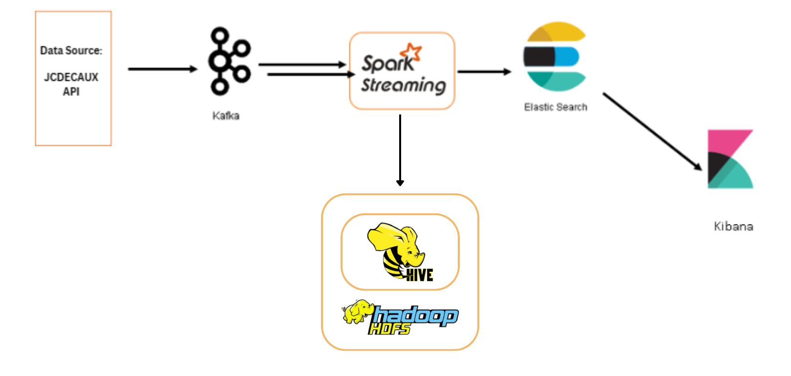

<h1 align="center">
  <br>
  Real-Time Cycling Station Monitor
</h1>

<div align="center">
  <h4>
    <a href="#overview">Overview</a> |
    <a href="#system-architecture">System Architecture</a> |
    <a href="#dockerized-environment">Dockerized Environment</a> |
    <a href="#prerequisites">Prerequisites</a> |
    <a href="#setup-and-running-instructions">Setup and Running Instructions</a> |
    <a href="#kibana-dashboard-visualization-example">Kibana Dashboard Visualization Example</a> |
    <a href="#conclusion">Conclusion</a>
  </h4>
</div>

<br>

## Overview

The Real-Time Cycling Station Monitor is a system designed to track and analyze the status of cycling stations. It utilizes a data pipeline comprising Kafka, Spark, Elasticsearch, and Kibana to process and visualize real-time data. This enables users to identify cycling stations with no available bikes and understand usage patterns.

## System Architecture

- **Kafka**: Ingests real-time data from cycling stations.
- **Spark**: Processes and analyzes the data.
- **Elasticsearch**: Stores and indexes the processed data.
- **Kibana**: Visualizes insights on an interactive dashboard.



## Dockerized Environment 

To ensure seamless operation and management, our Real-Time Cycling Station Monitor is built upon a Dockerized environment, encapsulating each component of the system within its own container. This approach not only fosters a modular architecture, making it easier to update and maintain individual parts without affecting the whole system, but also enhances scalability and fault tolerance. Each service, from Kafka for real-time data ingestion to Kibana for insightful visualizations, operates in an isolated yet interconnected manner through a custom Docker network. This setup not only reflects best practices in container orchestration but also provides a robust, scalable solution for real-time data processing and visualization. By adopting this architecture, users can enjoy a streamlined setup process, predictable behavior across environments, and a flexible system ready to adapt to future needs and improvements.


## Prerequisites

- Docker Desktop: Ensure Docker Desktop is installed and running on your system.
- Python: Ensure Python is installed for running the Kafka producer script.

## Setup and Running Instructions

For setting up and running the Real-Time Cycling Station Monitor, we've provided convenient scripts that handle building containers, submitting Spark jobs, and running the Kafka producer script. Depending on your operating system, follow the instructions for Windows or Unix-like systems (Linux/MacOS).

### Windows Users:

1. **Run the Batch Script**: Navigate to your project directory in the command prompt and execute the `run.bat` script.

    ```bash
    .\run.bat
    ```

    This script performs the following operations:
    - **Build and Run Containers**: Builds the Docker images and initializes the containers for Kafka, Spark, Elasticsearch, and Kibana.
    - **Submit the Spark Job**: Submits a Spark job to process and analyze the data.
    - **Run Kafka Producer Script**: Executes the Kafka producer script to send data to the Kafka topic.

### Unix-like System Users (Linux/MacOS):

1. **Run the Shell Script**: Open your terminal, navigate to your project directory, and execute the `run.sh` script.

    ```bash
    ./run.sh
    ```

    This script performs similar operations as the Windows batch file:
    - **Build and Run Containers**: Builds the Docker images and initializes the containers.
    - **Submit the Spark Job**: Submits the Spark job.
    - **Run Kafka Producer Script**: Executes the Kafka producer script.

### After Running the Scripts:
Once you've executed the appropriate script for your operating system:

- **Check Container Status**: Verify that all containers are up and running using:

    ```bash
    docker-compose ps
    ```

- **Visualize Data in Kibana**: Access Kibana by visiting `http://localhost:5601`. Set up an index pattern for Elasticsearch data and create a dashboard with a map visualization to view the status of the cycling stations.

- **Monitor Logs**: Check the logs for any services if needed using:

    ```bash
    docker-compose logs [service-name]
    ```

- **Stopping Services**: When you're done, you can stop all services using:

    ```bash
    docker-compose down
    ```

### 4. Visualize Data in Kibana
Access Kibana by visiting http://localhost:5601. Set up an index pattern for Elasticsearch data and create a dashboard with a map visualization to view the status of the cycling stations.

## Kibana Dashboard Visualization Example

### Map Chart - Available Bike Stands

Below is a screenshot of the Kibana dashboard showing the data filtered to display cycling stations where `available_bike_stands == 0`:


### Pie Chart - Available Bike Stands
The pie chart below represents the distribution of cycling stations with no available bike stands across different contract names for the latest timestamp. This visualization helps to quickly identify which areas are experiencing a high demand for bikes and may require restocking.


### Line Graph - Station Status Over Time
The line graph displayed here shows the number of available bike stands, total bike stands, and available bikes over a 6-minute window. This time-based visualization provides insights into usage patterns, peak times, and potential shortages, allowing for efficient management of the bike-sharing system.


## Conclusion
This project provides a comprehensive solution for monitoring cycling stations in real-time. By leveraging a robust data pipeline and advanced visualization tools, it delivers critical insights promptly and effectively. Customize the system according to your specific needs and enjoy a deeper understanding of cycling station dynamics.
