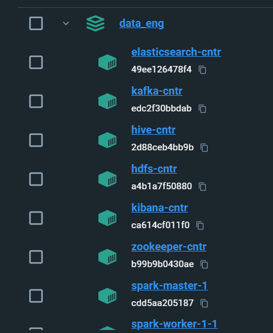
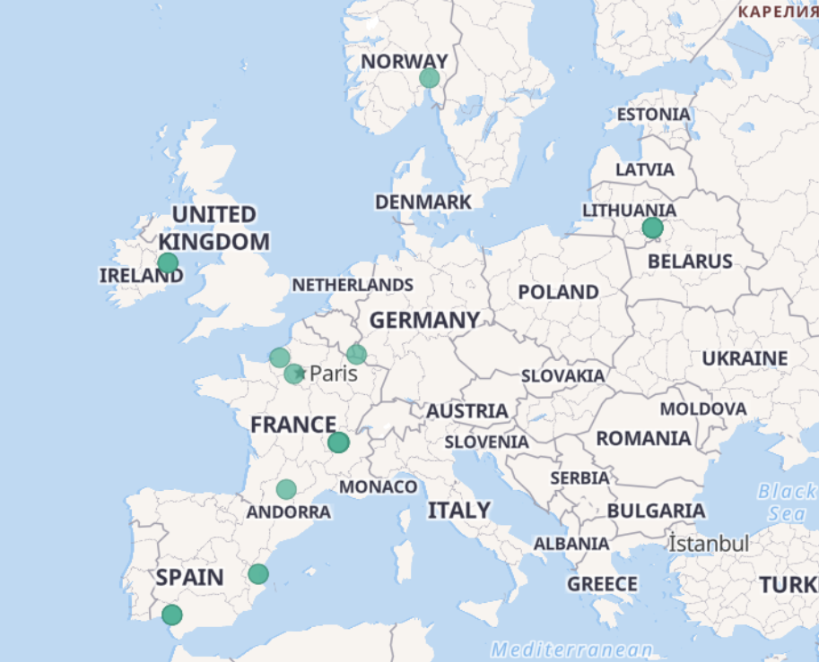
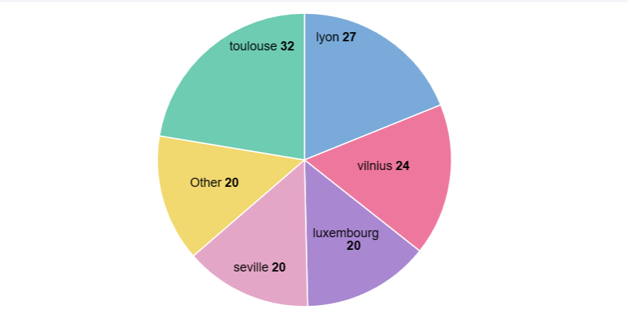
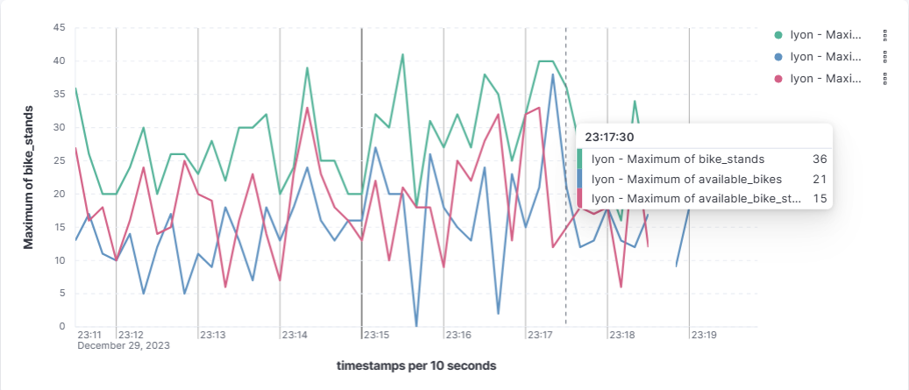

# Real-Time Cycling Station Monitor

## Overview

The Real-Time Cycling Station Monitor is a system designed to track and analyze the status of cycling stations. It utilizes a data pipeline comprising Kafka, Spark, Elasticsearch, and Kibana to process and visualize real-time data. This enables users to identify cycling stations with no available bikes and understand usage patterns.

## System Architecture

- **Kafka**: Ingests real-time data from cycling stations.
- **Spark**: Processes and analyzes the data.
- **Elasticsearch**: Stores and indexes the processed data.
- **Kibana**: Visualizes insights on an interactive dashboard, including a map highlighting stations with no available bikes.

## Dockerized Environment 


To ensure seamless operation and management, our Real-Time Cycling Station Monitor is built upon a Dockerized environment, encapsulating each component of the system within its own container. This approach not only fosters a modular architecture, making it easier to update and maintain individual parts without affecting the whole system, but also enhances scalability and fault tolerance. Each service, from Kafka for real-time data ingestion to Kibana for insightful visualizations, operates in an isolated yet interconnected manner through a custom Docker network. This setup not only reflects best practices in container orchestration but also provides a robust, scalable solution for real-time data processing and visualization. By adopting this architecture, users can enjoy a streamlined setup process, predictable behavior across environments, and a flexible system ready to adapt to future needs and improvements.




## Prerequisites

- Docker Desktop: Ensure Docker Desktop is installed and running on your system.
- Python: Ensure Python is installed for running the Kafka producer script.

## Setup and Running Instructions

### 1. Build and Run Containers

Before running the services, you need to build the Docker images and initialize the containers.

```sh
docker-compose build
docker-compose up -d
```
This will set up Kafka, Spark, Elasticsearch, and Kibana.


### 2. Submit the Spark Job
Run the Spark job to start processing the streaming data.

```sh
docker-compose exec spark-master spark-submit \
--class consumer \
--packages org.apache.spark:spark-sql-kafka-0-10_2.12:3.2.4,org.elasticsearch:elasticsearch-spark-30_2.12:8.8.2,commons-httpclient:commons-httpclient:3.1 \
pyspark_consumer.py
```

### 3. Run Kafka Producer Script
Execute the Kafka producer script to send data to the Kafka topic.

```sh
python ./kafka_producer.py
```

Ensure to replace the apiKey in the kafka_producer.py script with your own API key.

### 4. Visualize Data in Kibana
Access Kibana by visiting http://localhost:5601. Set up an index pattern for Elasticsearch data and create a dashboard with a map visualization to view the status of the cycling stations.

## Kibana Dashboard Visualization Example

### Map Chart - Available Bike Stands

Below is a screenshot of the Kibana dashboard showing the data filtered to display cycling stations where `available_bike_stands == 0`:



### Pie Chart - Available Bike Stands
The pie chart below represents the distribution of cycling stations with no available bike stands across different contract names for the latest timestamp. This visualization helps to quickly identify which areas are experiencing a high demand for bikes and may require restocking.



### Line Graph - Station Status Over Time
The line graph displayed here shows the number of available bike stands, total bike stands, and available bikes over a 6-minute window. This time-based visualization provides insights into usage patterns, peak times, and potential shortages, allowing for efficient management of the bike-sharing system.


## Conclusion
This project provides a comprehensive solution for monitoring cycling stations in real-time. By leveraging a robust data pipeline and advanced visualization tools, it delivers critical insights promptly and effectively. Customize the system according to your specific needs and enjoy a deeper understanding of cycling station dynamics.
